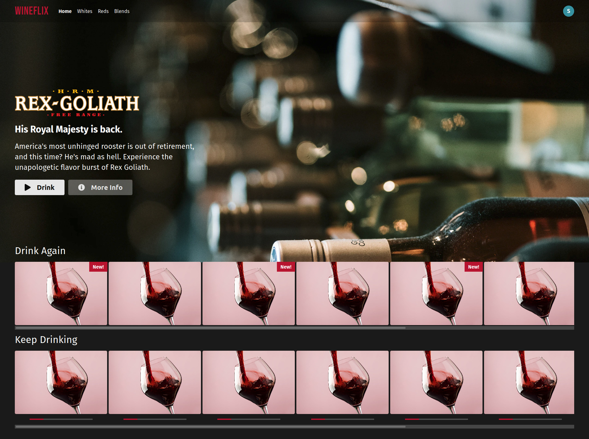

## Setup

* Requires node and Docker / Docker Compose
* Run `npm start`. You can access your running server on `http://localhost:8090`.

## Instructions

Refactor the HTML and CSS in `frontend/App.vue` to use components.

* Your solution should have over 10 components
* Replace all hard-coded data with the dynamic data below

## Data

```js
const wines = [{
  id: 1,
  imageUrl: '/red-wine.jpg',
  isNew: true,
  label: 'Wine',
  isFinished: true,
}, {
  id: 2,
  imageUrl: '/red-wine.jpg',
  label: 'Wine',
  isFinished: true,
}, {
  id: 3,
  imageUrl: '/red-wine.jpg',
  label: 'Wine',
  isNew: true,
  isFinished: true,
}, {
  id: 4,
  imageUrl: '/red-wine.jpg',
  label: 'Wine',
  isFinished: true,
}, {
  id: 5,
  imageUrl: '/red-wine.jpg',
  label: 'Wine',
  isNew: true,
  isFinished: true,
}, {
  id: 6,
  imageUrl: '/red-wine.jpg',
  label: 'Wine',
  isFinished: true,
}, {
  id: 7,
  imageUrl: '/red-wine.jpg',
  label: 'Wine',
  isFinished: true,
}, {
  id: 8,
  imageUrl: '/red-wine.jpg',
  label: 'Wine',
  isFinished: true,
}, {
  id: 1,
  imageUrl: '/red-wine.jpg',
  progress: 22,
  label: 'Wine',
}, {
  id: 2,
  imageUrl: '/red-wine.jpg',
  progress: 22,
  label: 'Wine',
}, {
  id: 3,
  imageUrl: '/red-wine.jpg',
  progress: 22,
  label: 'Wine',
}, {
  id: 4,
  imageUrl: '/red-wine.jpg',
  progress: 22,
  label: 'Wine',
}, {
  id: 5,
  imageUrl: '/red-wine.jpg',
  progress: 22,
  label: 'Wine',
}, {
  id: 6,
  imageUrl: '/red-wine.jpg',
  progress: 22,
  label: 'Wine',
}, {
  id: 7,
  imageUrl: '/red-wine.jpg',
  progress: 22,
  label: 'Wine',
}, {
  id: 8,
  imageUrl: '/red-wine.jpg',
  progress: 22,
  label: 'Wine',
}];
```

```js
const heroContent = {
  title: 'Rex Goliath',
  subtitle: 'His Royal Majesty is back.',
  imageUrl: '/rex-goliath-logo.png',
  description: `America's most unhinged rooster is out of retirement, and this time? He's mad
  as hell.  Experience the unapologetic flavor burst of Rex Goliath.`,
}
```
